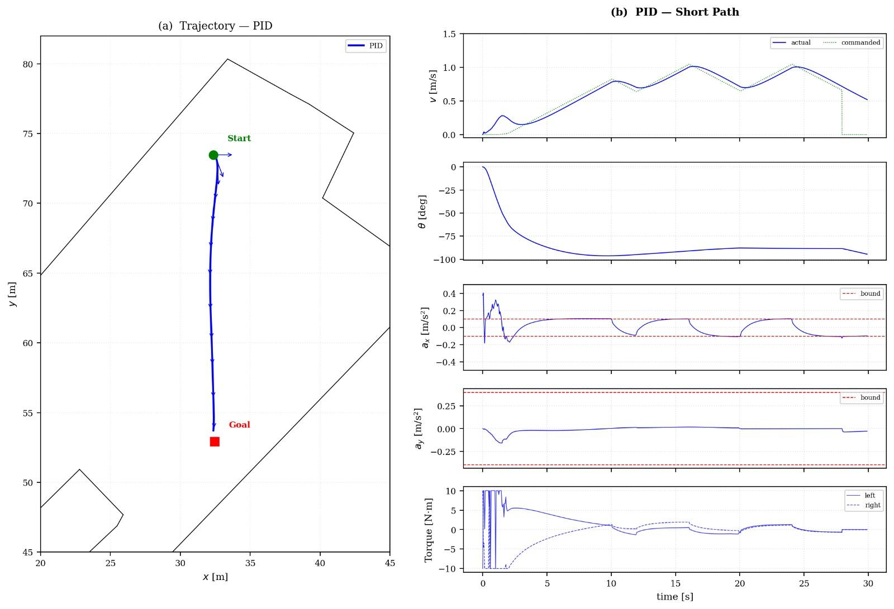
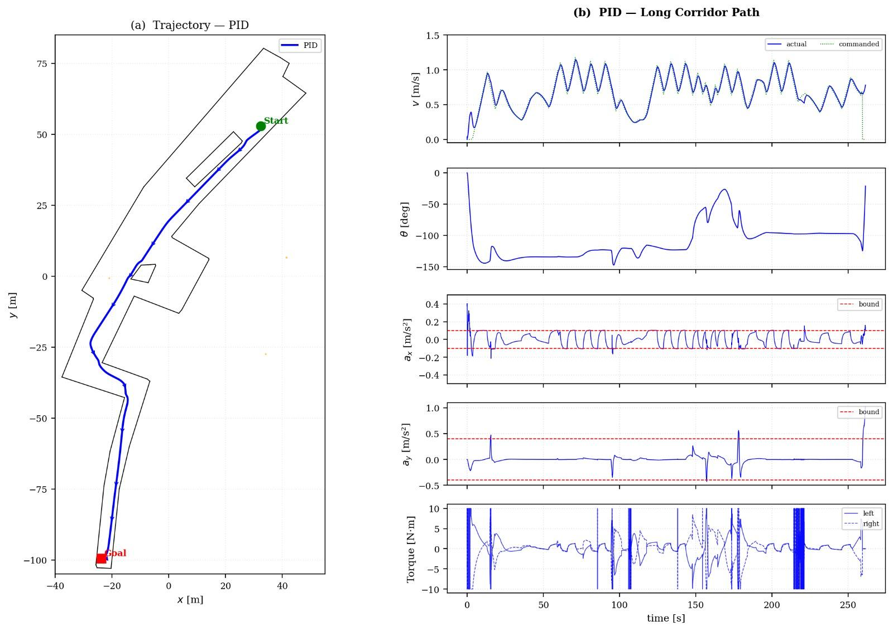

<div align="center">

# ♿ Adaptive Path Planning & Control for Autonomous Electric Wheelchairs

[](https://www.python.org/)
[](https://mujoco.org/)
[](https://stable-baselines3.readthedocs.io/)
[](LICENSE)
[]()

*A robust, modular, production-grade robotics framework integrating hierarchical classical navigation (WAP → SPD → ARGA → mHRVO), Model Predictive Control (MPC), and Reinforcement Learning (PPO) for high-precision autonomous navigation in large-scale hospital corridor environments.*

[Key Features](#-key-features) •
[Architecture](#-system-architecture) •
[Quickstart](#-quickstart) •
[Pipeline Overview](#-4-stage-classical-navigation-pipeline) •
[Path Visualizations](#️-path-planning-visualizations-short-path-vs-long-path) •
[Control & RL](#-controllers--rl-integration) •
[Testing](#-testing--verification)

---

</div>

## 🌟 Key Features

- **🏛️ 4-Stage Hierarchical Navigation Pipeline**:
  - **WAP** (*Waypoint & Attitude Planning*): DXF topological graph A* global path planning & attitude alignment.
  - **SPD** (*Speed Profile Design*): Jerk-bounded trapezoidal/S-curve velocity profiles adhering to strict acceleration limits ($\le 0.1 \text{ m/s}^2$).
  - **ARGA** (*Angular Rate Gain Adaptation*): Speed-dependent turning gain modulation to eliminate lateral passenger tipping.
  - **mHRVO** (*Modified Hybrid Reciprocal Velocity Obstacle*): Multi-agent reciprocal dynamic obstacle avoidance.
  - **Wall Proximity Guard**: Reactive wall repulsion vector fields ensuring zero corridor collisions.

- **🎛️ Receding-Horizon MPC & PID Controllers**:
  - Full non-linear kinematic differential-drive Model Predictive Control solving optimal motor torques at 50 Hz.
  - Fallback anti-windup PID controller with live torque clamping.

- **🤖 Hybrid Reinforcement Learning (PPO)**:
  - Gymnasium-compatible environment (`WheelchairRLEnv`).
  - Residual PPO policy trained via Stable-Baselines3 to output smooth steering/velocity corrections on top of the classical baseline.

- **🗺️ DXF Vector Floorplan Parser**:
  - Automated vector extraction and topological roadmap generation from real-world hospital DXF CAD floorplans ($86\text{m} \times 184\text{m}$).
  - Evaluated on both **short-path local corridor maneuvers** and **long-path multi-corridor traversals**.

- **🖥️ Interactive Viewer & Live Parameter Tuning**:
  - Real-time MuJoCo 3D visualization window.
  - Background Tkinter tuning dashboard for live adjustments to MPC weights, PID gains, SPD bounds, and HRVO horizons without restarting simulation.

---

## 🏗 System Architecture

```text
RAS_ver.5.5/
├── ras/                          # Main Python Package
│   ├── config.py                 # Centralized configuration & path resolver
│   ├── physics/                  # MuJoCo 3D wheelchair physics model
│   ├── map/                      # Hospital DXF parser & topological graph generator
│   ├── planning/                 # Classical 4-Stage pipeline (WAP, SPD, ARGA, mHRVO)
│   ├── control/                  # Differential Drive PID & Receding-Horizon MPC
│   ├── rl/                       # Gymnasium-compatible RL environment & rewards
│   └── ui/                       # Interactive viewer & Tkinter live tuning panel
├── scripts/                      # Executable Entrypoints
│   ├── main.py                   # Launch main 3D interactive simulation
│   ├── run_rl.py                 # Launch simulation with trained PPO RL agent
│   ├── train_rl.py               # Parallelized PPO model training script
│   ├── compare_controllers.py    # Headless benchmark generator (PID vs MPC)
│   └── game_prototype.py         # 2D algorithm prototype
├── assets/                       # Static DXF maps, reference paper PDFs, C++ code
├── outputs/                      # Simulation logs, trajectory data, & PNG plots
├── ShortPathPhoto.jpg            # Short path visual trajectory artifact
├── LongPathPhoto.jpg             # Long path visual trajectory artifact
└── tests/                        # Automated smoke test suite (22/22 passing)
```

---

## ⚡ Quickstart

### 1. Prerequisites & Installation

Clone the repository and install requirements:

```bash
git clone https://github.com/DrishMahajan05/Adaptive-Path-Planning-for-Autonomous-Wheel-Chairs.git
cd Adaptive-Path-Planning-for-Autonomous-Wheel-Chairs

# Install standard dependencies
pip install -r requirements.txt

# (Optional) Install package in editable mode
pip install -e .
```

### 2. Run Main 3D Simulation

Launch the interactive MuJoCo simulation with live parameter tuning:

```bash
python scripts/main.py
```

#### 🎮 Interactive Controls
| Key / Input | Action |
| :--- | :--- |
| **Hover + Press `X`** | Place waypoints on floorplan |
| **Press `S`** | **START** wheelchair navigation |
| **Backspace** | Clear waypoints and stop |
| **Press `R`** | Reset simulation to origin |
| **Press `O`** | Respawn dynamic obstacles |
| **`Esc`** | Exit viewer |

---

## 🔄 4-Stage Classical Navigation Pipeline


1. **WAP**: Computes shortest topological corridor path using A* search on DXF wall segment geometries.
2. **SPD**: Computes target linear velocity $v_d$ based on distance to goal, enforcing passenger safety limits:
   $$\text{Acceleration Limit: } |a_x| \le 0.1 \text{ m/s}^2$$
3. **ARGA**: Dynamically scales turning rate $\omega_d$ to satisfy lateral acceleration upper bound $a_{y,\text{max}}$:
   $$K = \min\left(K_{\text{default}}, \frac{a_{y,\text{max}}}{v \cdot |\Delta\theta| \cdot (1 - e^{-T_a/\tau_c})}\right)$$
4. **mHRVO**: Constructs reciprocal velocity obstacles for multi-agent dynamic obstacle avoidance while preserving corridor direction.

---

## 🖼️ Path Planning Visualizations: Short Path vs. Long Path

The system evaluates topological A* global path planning, speed profiling, and collision avoidance across varying route lengths within the $86\text{m} \times 184\text{m}$ hospital corridor map.

<div align="center">

| 📍 Short-Path Navigation | 🚀 Long-Path Navigation |
| :---: | :---: |
|  |  |
| **Short Path**: Local corridor maneuver demonstrating precise waypoint alignment, sharp cornering control, and dynamic wall repulsion. | **Long Path**: Extended multi-corridor navigation traversing the entire hospital floorplan with jerk-bounded velocity profiles. |

</div>

---

## 📊 Controllers & RL Integration

### Benchmarking PID vs. MPC
Run the automated comparison tool to generate comparative metrics and 6 publication-ready trajectory plots:

```bash
python scripts/compare_controllers.py
```

### Train Reinforcement Learning Agent
Train a PPO policy using parallelized Gymnasium environments:

```bash
python scripts/train_rl.py --timesteps 500000 --n-envs 4
```

### Execute Trained RL Agent
Run the interactive viewer powered by the trained PPO network:

```bash
python scripts/run_rl.py
```

---

## 🧪 Testing & Verification

Run the comprehensive 22-point automated test suite:

```bash
python tests/test_smoke.py
```

```text
==================================================
  Results:  22 passed  /  0 failed
==================================================
```

---

## 📜 License & Citation

Distributed under the MIT License. See `LICENSE` for more information.

If you find this project useful in your robotics research, please consider starring ⭐ the repository!
